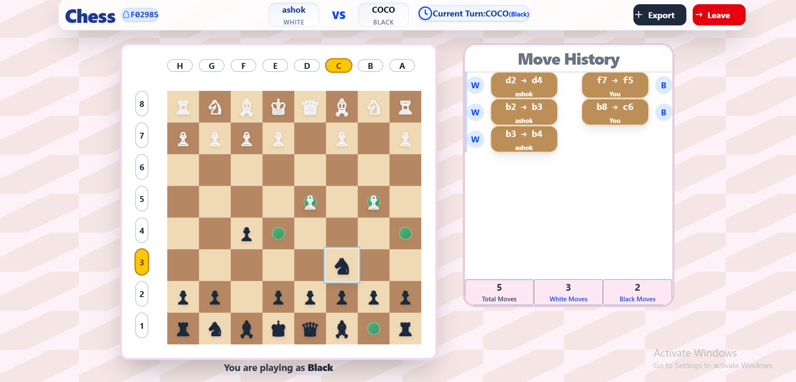
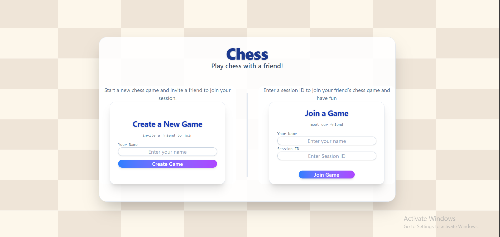

# ♟️ Real-Time Multiplayer Chess Game

[](https://nodejs.org/)
[](https://reactjs.org/)
[](https://socket.io/)
[](LICENSE)

### Game Interface

*Real-time chess game with move history and player information*

A real-time, two-player chess game built with React, Node.js, and Socket.IO, featuring move validation, history tracking, and a sleek responsive design.


## 🚀 Features

- ♟️ **Real-time multiplayer gameplay** via WebSocket
- ✅ **Accurate move validation** using chess.js
- 💾 **Persistent game state** across sessions
- 📜 **Move history tracking**
- ⬇️ **Game export functionality** (.PGN support coming soon!)
- 🎯 **Check/Checkmate detection**
- 🔄 **Auto-reconnection** on network issues

## 🛠 Tech Stack

| Layer | Technology |
|-------|------------|
| **Frontend** | React, Vite, Socket.IO Client |
| **Backend** | Node.js, Express, Socket.IO |
| **Chess Logic** | chess.js |
| **Styling** | CSS3, Flexbox/Grid, Responsive Design |

## ⚙️ Getting Started

### Prerequisites

- Node.js v14 or higher
- npm or yarn package manager

### 📦 Installation

1. **Clone the repository**
   ```bash
   git clone https://github.com/Ashokkedari/Chess_Game.git
   cd Chess_Game
   ```

2. **Install backend dependencies**
   ```bash
   cd backend
   npm install
   ```

3. **Install frontend dependencies**
   ```bash
   cd ../chess_application
   npm install
   ```

### ▶️ Running the Application

1. **Start the backend server**
   ```bash
   cd backend
   npm run dev
   ```
   The backend will start on `http://localhost:3000`

2. **Start the frontend development server**
   ```bash
   cd ../chess_application
   npm run dev
   ```
   The frontend will start on `http://localhost:5173`

3. **Open your browser and navigate to:**
   ```
   http://localhost:5173
   ```

## 🕹️ How to Play

1. **Create a new game** or **join an existing one** using a Session ID
2. **Share the Session ID** with your opponent
3. **Start playing** real-time chess with validated moves and history tracking
4. **Track your moves** with the built-in move history
5. **Export your games** for analysis (coming soon!)

## 📁 Project Structure

```
Chess_Game/
├── backend/                    # Express + Socket.IO backend
│   ├── server.js              # Main server file
│   ├── package.json           # Backend dependencies
│   └── node_modules/          # Backend packages
├── chess_application/         # React frontend
│   ├── src/
│   │   ├── components/        # React components
│   │   │   ├── ChessBoard.jsx
│   │   │   ├── CreateGame.jsx
│   │   │   ├── JoinGame.jsx
│   │   │   └── MoveHistory.jsx
│   │   ├── pages/            # Page components
│   │   │   ├── GamePage.jsx
│   │   │   └── SessionPage.jsx
│   │   ├── App.jsx           # Main app component
│   │   ├── socket.js         # Socket.IO client setup
│   │   └── main.jsx          # App entry point
│   ├── package.json          # Frontend dependencies
│   └── vite.config.js        # Vite configuration
└── README.md                 # This file
```

## 🔧 Development

### Available Scripts

**Backend:**
```bash
npm run dev      # Start development server with nodemon
npm start        # Start production server
```

**Frontend:**
```bash
npm run dev      # Start development server
npm run build    # Build for production
npm run preview  # Preview production build
```

## 📸 Screenshots


### Session Creation

*Create or join a game session with a unique ID*

---

### 🐛 Reporting Bugs

- Open an issue with a clear description of the bug
- Include steps to reproduce the problem
- Add screenshots if applicable

### 💡 Suggesting Features

- Open an issue with your feature request
- Describe the feature and its benefits
- Consider contributing the implementation

## 📝 License

This project is licensed under the **MIT License** - see the [LICENSE](LICENSE) file for details.

You are free to:
- ✅ Use the software for any purpose
- ✅ Modify the software
- ✅ Distribute the software
- ✅ Distribute modified versions

## 🙏 Acknowledgments

- [chess.js](https://github.com/jhlywa/chess.js) for chess logic
- [Socket.IO](https://socket.io/) for real-time communication
- [React](https://reactjs.org/) for the frontend framework
- [Vite](https://vitejs.dev/) for the build tool

## 📞 Support

If you have any questions or need help:

- 🐛 **Bug Reports**: [Open an Issue](https://github.com/Ashokkedari/Chess_Game/issues)
- 💡 **Feature Requests**: [Open an Issue](https://github.com/Ashokkedari/Chess_Game/issues)
- 📧 **Email**: ashokkedari385@gmail.com

---

**Made with ❤️ by [Ashokkedari](https://github.com/Ashokkedari)**
